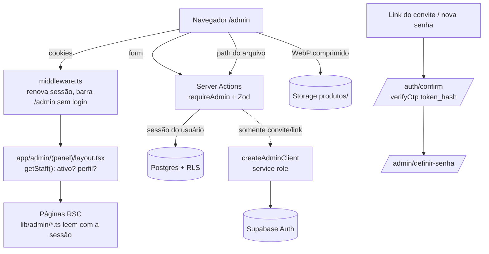

# 02 · Painel de catálogo — Design

**Spec**: `.specs/features/02-catalog-panel/spec.md`
**Status**: Approved (2026-09-26, com links por WhatsApp — AD-007)

---

## Architecture Overview

O painel é parte do mesmo app Next.js, em `/admin`. Toda escrita passa por **Server Actions que usam a sessão do próprio usuário** (anon key + cookie), então o RLS da etapa 01 é a trava final: se a checagem de perfil no código falhar, o banco ainda recusa. A service role só aparece em duas ações de Usuários (convite e link de senha), sempre depois de `requireAdmin()`.

Fotos sobem **direto do navegador para o Storage** com a sessão do admin (a política do bucket exige `is_admin()`), depois de convertidas para WebP no próprio celular. Só então uma Server Action grava a linha em `product_images`.



---

## Decisão que precisa de aprovação: convites e senha sem e-mail

O SMTP padrão do Supabase Free **só entrega para e-mails da equipe da organização Supabase e no máximo 2 por hora**. Convite para atendente e "Esqueci minha senha" por e-mail não funcionariam de forma confiável.

**Proposta:**

- Convite e redefinição de senha geram um **link de uso único** com `auth.admin.generateLink` (não envia e-mail). O painel mostra o link com os botões **Copiar** e **Enviar pelo WhatsApp**, e a dona manda para a pessoa.
- Em `/admin/login`, "Esqueci minha senha" mostra: "Peça um novo link a um administrador".
- O próprio Leonardo recebe o primeiro link por script: `npm run admin:link -- <email>`.
- Quando houver SMTP próprio (ex. Resend, antes do lançamento, M2), trocamos para envio por e-mail sem mudar o fluxo de `/auth/confirm`.

Isso muda o critério 6 do Login na spec: o link continua levando a `/admin/definir-senha`, mas chega por WhatsApp em vez de e-mail.

---

## Code Reuse Analysis

| Existente | Local | Uso |
|---|---|---|
| `createClient()` (sessão via cookies) | `lib/supabase/server.ts` | Base de leituras e Server Actions do painel |
| `createAdminClient()` | `lib/supabase/admin.ts` | Só `generateLink` e `listUsers` em Usuários |
| `publicEnv()` / `serverEnv()` | `lib/env.ts` | Idem |
| `formatBRL` | `lib/money.ts` | Ganha `parseBRL` ao lado |
| `productImageUrl`, `listStores`, `listVitrineMenu` | `lib/catalog.ts` | Reuso no painel (miniaturas) e ganha `listHomeHighlights` |
| `is_admin()`, `staff_store()`, políticas "admin manages *" | migrations 01 | Autorização de toda escrita |
| `findUserIdByEmail`, convite | `scripts/seed.ts` | Mesmo padrão no script `admin-link` |
| Tokens, `Logo` | `app/globals.css`, `components/site/logo.tsx` | Visual do painel (fundo linho, texto cacau, ações oliva) |

---

## Rotas

```
middleware.ts                             renova sessão; /admin/* sem sessão → /admin/login
app/auth/confirm/route.ts                 verifyOtp(token_hash, type) → next (só /admin/*)
app/admin/(auth)/login/page.tsx           e-mail + senha
app/admin/(auth)/definir-senha/page.tsx   nova senha (exige sessão do link)
app/admin/(panel)/layout.tsx              getStaff(); menu por perfil; inativo → signOut
app/admin/(panel)/page.tsx                início (admin: atalhos · atendente: placeholder da loja)
app/admin/(panel)/produtos/page.tsx       lista + filtro + busca
app/admin/(panel)/produtos/novo/page.tsx
app/admin/(panel)/produtos/[id]/page.tsx  formulário + fotos + adicionais
app/admin/(panel)/categorias/page.tsx     lista ordenável + criar/editar inline
app/admin/(panel)/adicionais/page.tsx     idem
app/admin/(panel)/lojas/page.tsx
app/admin/(panel)/lojas/[id]/page.tsx     dados + horários
app/admin/(panel)/destaques/page.tsx
app/admin/(panel)/destaques/[id]/page.tsx ("novo" = id "novo")
app/admin/(panel)/usuarios/page.tsx       lista + convidar + link de senha
```

Cada área tem `actions.ts` ao lado da página.

---

## Components

### Auth e autorização — `lib/auth.ts` (server-only)

- `getStaff(): Promise<Staff | null>` — `auth.getUser()` + linha própria em `staff` (RLS "reads own row"). `null` se não logado.
- `requireStaff()` — sem sessão → `redirect('/admin/login')`; staff inativo ou ausente → `signOut()` + `redirect('/admin/login?erro=inativo')`.
- `requireAdmin()` — `requireStaff()` + perfil admin; senão `forbidden()` na página e erro na action.
- Todas as Server Actions de catálogo começam com `await requireAdmin()`.

### `middleware.ts`

Padrão oficial do `@supabase/ssr` (`updateSession`): cria o client com cookies do request/response, chama `auth.getUser()` para renovar tokens e redireciona `/admin/*` (exceto `login`, `definir-senha`) sem usuário. Matcher: `/admin/:path*` e `/auth/:path*`. O site público não passa pelo middleware.

### `/auth/confirm`

`GET ?token_hash&type=invite|recovery&next=/admin/definir-senha` → `verifyOtp` → redirect para `next` se começar com `/admin/`, senão `/admin`. Falha → `/admin/login?erro=link` ("Link inválido ou expirado. Peça um novo.").

### Validação — `lib/validators/*.ts` (Zod, sem dependência de Next)

| Arquivo | Conteúdo |
|---|---|
| `product.ts` | schema discriminado por `type`: comum (nome, categoria, descrição, preço, `price_pending`, ativo, lojas) + `bolo_kg` (pesos ≥1, formatos ≥1, antecedência) + `cento` (mín., passo) + `kit` (conteúdo) |
| `category.ts`, `addon.ts` | nome, tipo / preço |
| `store.ts` | dados + `hours` (7 dias, `null` = fechada, `close > open`) |
| `highlight.ts` | slot, título, CTA (`/…` ou `https://…`), período (`fim > início`) |
| `staff.ts` | e-mail, nome, perfil, loja obrigatória para atendente |

Helpers puros testáveis: `parseBRL(text): number | null` (`lib/money.ts`), `slugify(text)` (`lib/slug.ts`), `normalizeWhatsapp(text): string | null` e `formatWhatsapp(digits)` (`lib/phone.ts`).

Resposta padrão das actions (para `useActionState`):

```ts
type ActionState = { ok: boolean; message?: string; fieldErrors?: Record<string, string[]> };
```

### Consultas do painel — `lib/admin/*.ts` (server-only)

`products.ts` (lista com filtro/busca, detalhe com imagens e adicionais), `categories.ts`, `addons.ts`, `stores.ts`, `highlights.ts`, `staff.ts` (junta `staff` com `auth.admin.listUsers` para e-mail e "convite pendente" = `last_sign_in_at` nulo). Todas lançam erro do Supabase; nenhuma engole.

### Slug único — `lib/admin/slug.ts`

`uniqueSlug(table, name, excludeId?)`: `slugify` + busca slugs com o mesmo prefixo; adiciona `-2`, `-3`… Se o insert ainda colidir (corrida), a action tenta uma vez com o próximo sufixo.

### Fotos — `components/admin/product-images.tsx` (client)

1. `<input type="file" accept="image/*" multiple>` (abre câmera ou galeria no celular).
2. `browser-image-compression`: `fileType: 'image/webp'`, `maxWidthOrHeight: 1600`, `initialQuality: 0.82`.
3. Upload com `lib/supabase/browser.ts` para `products/<productId>/<uuid>.webp`.
4. Action `addProductImage(productId, path)`: valida que `path` começa com `products/<productId>/`, insere com `sort = max + 1`. Se o insert falhar, remove o arquivo.
5. Reordenar: lista `@dnd-kit/sortable` (toque e mouse) + botões ↑/↓; salva com `reorderProductImages(productId, ids)`.
6. Remover: apaga a linha e depois o arquivo (arquivo órfão é tolerável, linha órfã não).

Em "Novo produto" as fotos aparecem depois do primeiro salvamento (precisa do `id`).

### Lista ordenável — `components/admin/sortable-list.tsx` (client)

Genérica sobre `{ id, label }`, usada em categorias, adicionais e fotos. Chama `onReorder(ids)`.

### Outros componentes (`components/admin/`)

`admin-shell.tsx` (barra superior + menu em gaveta no celular, itens por perfil), `field.tsx` (label + erro), `submit-button.tsx` (`useFormStatus`), `money-input.tsx`, `hours-editor.tsx`, `status-badge.tsx`, `copy-link.tsx` (copiar + `wa.me/?text=`).

### Site: destaques na home

`lib/catalog.ts` ganha `listHomeHighlights()`: destaques vigentes (RLS já filtra período) com produto vinculado; descarta os que apontam para produto não visível (inativo ou preço a definir). Imagem: `image_path` próprio, senão capa do produto, senão sem imagem. Componente `components/site/home-highlights.tsx`.

### Scripts

`scripts/admin-link.ts` — `npm run admin:link -- <email> [invite|recovery]` imprime o link `…/auth/confirm?token_hash=…` usando `NEXT_PUBLIC_SITE_URL`.

---

## Data Model — migration `20260927000100_catalog_panel.sql`

| Mudança | Motivo |
|---|---|
| Política pública de `products`: `active and not price_pending` | Preço a definir fora do site, no banco (AD-006) |
| `product_availability`: acrescenta `and not p.price_pending` | Idem |
| Função `reorder(p_table text, p_ids uuid[])`, `security invoker`, whitelist (`categories`, `addons`, `product_images`, `stores`, `highlights`), um `update … from unnest … with ordinality` | Reordenação atômica; RLS do chamador decide (só admin passa) |
| Trigger `ensure_active_admin` (after update/delete em `staff`, por comando) | Nunca ficar sem admin ativo, mesmo por requisição direta |
| `grant execute on function reorder` a `authenticated` | Regra 8 |

`lib/database.types.ts` ganha `reorder` em `Functions`.

---

## Error Handling Strategy

| Cenário | Tratamento | O que a pessoa vê |
|---|---|---|
| Campo inválido | Zod no servidor → `fieldErrors` | Mensagem no campo, dados preservados |
| Atendente chama action de catálogo | `requireAdmin` lança; RLS recusaria de qualquer forma | "Você não tem permissão para esta ação" |
| Erro do Supabase numa action | Loga no servidor com contexto; retorna mensagem genérica | "Não foi possível salvar. Tente de novo." |
| Slug em colisão | Nova tentativa com sufixo | Nada |
| Upload falha / sem rede | Nada é gravado no banco | "Falha ao enviar a foto. Verifique a conexão." |
| Imagem inválida | Compressão lança antes do upload | "Não foi possível usar esta imagem" |
| Último admin | Trigger recusa; action traduz o erro | "É preciso manter pelo menos um administrador ativo" |
| Link expirado | `/auth/confirm` falha | Login com "Link inválido ou expirado. Peça um novo." |
| E-mail já na equipe | Checagem antes de gerar link | "Este e-mail já faz parte da equipe" |

---

## Testes

| Tipo | Cobre |
|---|---|
| Unit | `parseBRL`, `slugify`, `normalizeWhatsapp`, todos os schemas Zod (regras por tipo de produto, horários, CTA) |
| PGlite (scratchpad) | migration nova: `price_pending` invisível para anon e na view; `reorder` funciona para admin e não faz nada para atendente; trigger do último admin |
| Integração (projeto real) | cria usuários de teste (admin e atendente) com service role, faz login com senha, e confere: atendente **não** consegue insert/update em produtos, categorias, lojas, destaques, adicionais, staff nem upload no bucket; admin consegue; anon não vê produto com preço a definir. Limpa tudo no fim |
| Navegador (localhost, 360 px) | login com o admin de teste, cadastrar bebida com foto, vê-la no `/cardapio`; atendente bloqueado |

Credenciais do admin/atendente de teste ficam só no `.env.local` (geradas pelo teste), nunca no chat nem no repo.

---

## Tech Decisions

| Decisão | Escolha | Motivo |
|---|---|---|
| Escrita | Server Actions + sessão do usuário | RLS é a trava; sem service role no caminho comum |
| Fotos | Upload direto navegador → Storage | Evita limite de corpo de Server Action (1 MB) e tráfego duplo |
| Arrastar | `@dnd-kit/core` + `sortable` | Funciona com toque; ↑/↓ como alternativa acessível |
| Compressão | `browser-image-compression` 2.x | Definido no SPEC §2 |
| Convite/senha | `generateLink` + link por WhatsApp | SMTP do Free não entrega para a equipe (ver seção de aprovação) |
| Reordenação | Uma função SQL com whitelist | Atômica; evita N updates soltos |
| Último admin | Trigger no banco | Vale para qualquer caminho de escrita |
| Painel no celular | Layout de coluna única, menu em gaveta, alvos de toque ≥ 44 px | Equipe opera no balcão |

---

## Ações necessárias no Supabase

Nenhuma. O link é montado para o próprio domínio (`/auth/confirm?token_hash=…`) e validado no servidor com `verifyOtp`, então o Supabase não redireciona e dispensa Redirect URLs e mudança de template de e-mail.
