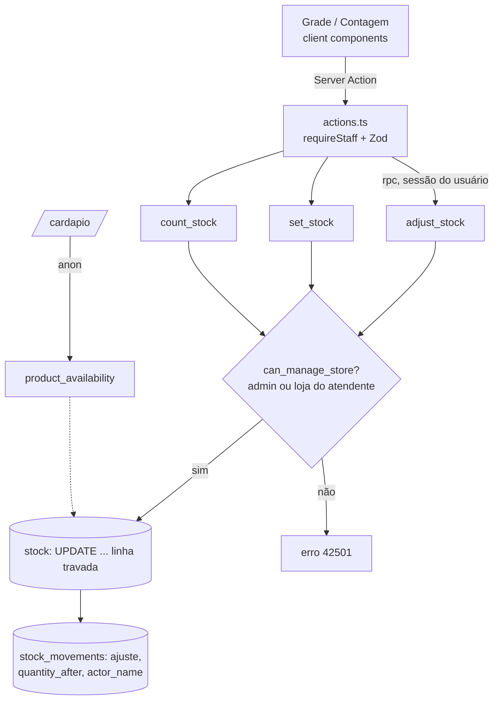

# 03 · Estoque — Design

**Spec**: `.specs/features/03-stock/spec.md`
**Status**: Approved (2026-09-26; grupo "Fora do site" só para admin)

---

## Architecture Overview

`stock` e `stock_movements` continuam **sem política de escrita** (etapa 01). Toda mudança passa por três funções Postgres `security definer` que, numa transação só: conferem se quem chamou pode mexer naquela loja, travam a linha, mudam a quantidade e gravam o movimento. O app chama essas funções por Server Actions usando a sessão da pessoa (`auth.uid()` identifica quem fez).

---

## Code Reuse Analysis

| Existente | Local | Uso |
|---|---|---|
| `is_admin()`, `staff_store()` | migration 01 | Base de `can_manage_store()` |
| Política "staff reads stock / movements" | migration 01 | Leitura da grade e do histórico já filtrada por loja |
| `requireStaff()`, `getSession()` | `lib/auth.ts` | Páginas e actions (atendente e admin) |
| `ActionState`, `readForm`, Zod | `lib/validators/common.ts` | Validação da contagem |
| `StatusBadge`, `Field`, `SubmitButton`, `useAdminForm` | `components/admin/` | UI |
| `formatDateTime` | `lib/datetime.ts` | Histórico em horário de Campo Grande |
| `dbFailure` | `lib/admin/common.ts` | Ganha tradução dos códigos novos |
| `StorePicker` (padrão GET form) | `components/site/store-picker.tsx` | Mesmo padrão no seletor de loja do admin |

---

## Data Model — migration `20260928000100_stock.sql`

### Colunas novas em `stock_movements`

| Coluna | Motivo |
|---|---|
| `quantity_after integer` | Histórico mostra "ficou com N" sem somar movimentos |
| `actor_name text` | Nome de quem fez, gravado na hora (como `name_snapshot` dos pedidos). `user_id` aponta para `auth.users`, sem vínculo com `staff` que o PostgREST consiga embutir, e o atendente não pode ler a equipe inteira |

### Funções (todas `security definer`, `search_path = ''`, `execute` só para `authenticated`)

| Função | Comportamento |
|---|---|
| `can_manage_store(p_store_id) → boolean` | `is_admin() or staff_store() = p_store_id` |
| `adjust_stock(p_product_id, p_store_id, p_delta) → integer` | Garante a linha (`insert … quantity 0 on conflict do nothing`), `update … set quantity = quantity + p_delta where quantity + p_delta between 0 and 9999 returning quantity`. Sem linha atualizada → erro. `p_delta = 0` → devolve o atual sem movimento |
| `set_stock(p_product_id, p_store_id, p_quantity) → integer` | Garante a linha, `select … for update`, `delta = novo − atual`; se 0, devolve sem movimento; senão atualiza e grava movimento. "Esgotar" = `set_stock(…, 0)` |
| `count_stock(p_store_id, p_items jsonb) → integer` | `p_items = [{product_id, quantity}]`. Valida tudo antes; aplica a lógica de `set_stock` item a item na mesma transação; devolve quantos mudaram. Qualquer erro desfaz tudo |

Validações comuns dentro das funções: loja existe, produto existe e é `vitrine`, quantidade inteira entre 0 e 9999.

Códigos de erro (traduzidos em `dbFailure`):

| Código | Mensagem na tela |
|---|---|
| `42501` | "Você não pode mexer no estoque desta loja." |
| `CK002` | "O estoque não pode ficar negativo." |
| `CK003` | "Quantidade acima de 9999. Confira o número." |
| `CK004` | "Este produto não é de vitrine." |

A concorrência vem de graça: `UPDATE … quantity = quantity + delta` trava a linha, então 20 incrementos simultâneos viram +20.

### Saldo inicial

A mesma migration grava um movimento `ajuste` para cada linha de `stock` com quantidade > 0 que ainda não tem movimento: `delta = quantity`, `quantity_after = quantity`, `actor_name = 'Saldo inicial'`, `user_id` nulo. Assim, a soma dos movimentos bate com a quantidade desde o começo.

---

## Components

### Consultas — `lib/admin/stock.ts` (server-only)

- `getStockGrid(supabase, storeIds: string[])`: produtos `vitrine` (com categoria e ordem) + linhas de `stock` das lojas. Devolve, por loja, grupos por categoria com `{ productId, name, quantity, visible }`. Sem linha = 0. `visible` = ativo, sem preço pendente e vendido na loja.
  - O atendente só recebe do RLS os produtos visíveis ao público, então o grupo "Fora do site" aparece só para o admin.
- `listMovements(supabase, filters, limit)`: `stock_movements` com `product:products(name)`, `store:stores(name)`, filtros por produto/loja/período, ordem decrescente, `limit + 1` para saber se há mais.

### Páginas

| Rota | Conteúdo |
|---|---|
| `/admin/estoque?loja=<slug>&busca=` | Atendente: sempre a própria loja (ignora `loja`). Admin: seletor de loja + opção "Todas as lojas" |
| `/admin/estoque?loja=todas` (admin) | Tabela produto × loja só de leitura (tela larga); tocar numa célula abre aquela loja |
| `/admin/estoque/contagem?loja=<slug>` | Modo contagem |
| `/admin/estoque/historico?loja&produto&de&ate&limite` | Histórico; "Carregar mais" aumenta `limite` em 50 |

### Client components (`components/admin/stock/`)

- `stock-row.tsx`: nome, quantidade, **−**, **+**, **Definir** (abre campo numérico inline com Salvar/Cancelar), **Esgotar**, link "Histórico". Guarda `confirmed` (valor do servidor) e `pendingDelta`; mostra `confirmed + pendingDelta` enquanto a action roda e, na resposta, adota a quantidade devolvida pelo banco. Em erro, volta para `confirmed` e mostra a mensagem. Linhas com 0 recebem o selo **Esgotado**.
- `count-form.tsx`: um `<input type="number" inputMode="numeric">` por item, `useAdminForm` com eco dos valores; manda **todos** os itens; o banco ignora os iguais. Mostra "N itens atualizados".
- `stock-filter.tsx`: busca por nome no próprio cliente (lista já carregada, dezenas de itens).

### Server Actions — `app/admin/(panel)/estoque/actions.ts`

`adjustStock(productId, storeId, delta)`, `setStock(productId, storeId, quantity)`, `countStock(storeId, _prev, formData)`: todas com `requireStaff`-equivalente para actions (`getStaffContext()`, novo em `lib/auth.ts`: staff ativo de qualquer perfil) + Zod; chamam o `rpc`; `revalidatePath('/admin/estoque', 'layout')`. A autorização por loja é do banco.

### Menu

`ATTENDANT_ITEMS` e `ADMIN_ITEMS` ganham "Estoque". O início do atendente troca o placeholder por um atalho para o estoque da loja.

---

## Error Handling Strategy

| Cenário | Tratamento | O que a pessoa vê |
|---|---|---|
| Ajuste negativo | `CK002` na função | "O estoque não pode ficar negativo." e o valor real |
| Outra loja | `42501` na função | "Você não pode mexer no estoque desta loja." |
| Rede falha | Action rejeita; linha volta ao confirmado | "Não foi possível salvar. Tente de novo." |
| Contagem com campo inválido | Zod no servidor; nada vai ao banco | Campos destacados, valores mantidos |
| Contagem com erro no banco | Transação desfeita | "Nada foi salvo. …" |
| Sessão expirada | `getStaffContext` nulo | Mensagem + link para entrar |

---

## Testes

| Tipo | Cobre |
|---|---|
| Unit | Schema da contagem (inteiro, 0–9999, lista), montagem da grade (sem linha = 0, agrupamento, `visible`) |
| PGlite | as 3 funções: atendente na própria loja ok, outra loja 42501; negativo CK002; > 9999 CK003; produto de encomenda CK004; `set_stock` igual não grava; `count_stock` com item inválido desfaz tudo; saldo inicial fecha a soma; anon sem `execute` |
| Integração (projeto real) | 20 `adjust_stock(+1)` em paralelo = +20; soma dos movimentos = quantidade em todas as linhas; atendente da Loja 2 não ajusta a Loja 1 nem lê seus movimentos; `set_stock(0)` deixa `available = false` na view pública; limpeza devolve os valores originais |
| Navegador (360 px) | Esgotar Fatia Karen na Loja 1 → "Esgotado" no `/cardapio?loja=estiva`; contagem de 3 itens → 3 movimentos; atendente só vê a própria loja |

---

## Tech Decisions

| Decisão | Escolha | Motivo |
|---|---|---|
| Onde mora a regra | Funções `security definer` no Postgres | Regra 2 do CLAUDE.md; atomicidade e trava de linha de graça |
| Quem fez | `actor_name` gravado no movimento | Sem join com `staff` (RLS do atendente) e sem mudar se a pessoa trocar de nome |
| Contagem | Uma função recebendo JSON | Uma transação, um round-trip, tudo ou nada |
| Tela otimista | Delta pendente + valor do banco na resposta | Toques rápidos somam na tela, mas a verdade é sempre o banco |
| "Todas as lojas" | Só leitura | Ajuste sempre com a loja explícita, evita tocar na coluna errada no celular |
