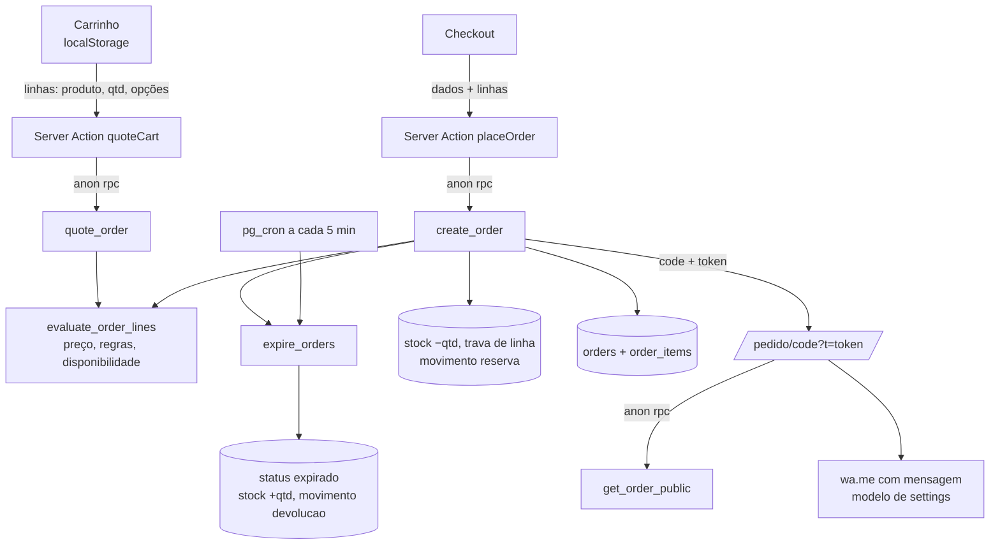

# 04 · Pedido — Design

**Spec**: `.specs/features/04-orders/spec.md`
**Status**: Approved (2026-09-26)

---

## Architecture Overview

O navegador guarda só **o que** o cliente quer (produto, quantidade, opções). **Quanto custa e se pode** é sempre decidido no Postgres por uma função interna única, `evaluate_order_lines`, usada por dois caminhos:

- `quote_order` (leitura): devolve linhas com preço, disponibilidade e problemas, sem gravar. Alimenta carrinho, troca de loja e checkout.
- `create_order` (escrita): chama a mesma avaliação, recusa se houver qualquer problema, reserva o estoque com trava de linha e grava pedido, itens e movimentos numa transação.

Anon continua sem tocar `orders`/`order_items`: só executa `quote_order`, `create_order` e `get_order_public`.

---

## Code Reuse Analysis

| Existente | Local | Uso |
|---|---|---|
| `createPublicClient()` | `lib/supabase/public.ts` | Todas as chamadas do site (anon) |
| `listVitrineMenu`, `MenuProduct`, `productImageUrl` | `lib/catalog.ts`, `lib/images.ts` | Cardápio ganha botão Adicionar; encomendas reusa o padrão |
| `normalizeWhatsapp`, `formatWhatsapp` | `lib/phone.ts` | WhatsApp do cliente |
| `formatBRL`, `parseBRL` | `lib/money.ts` | Totais |
| `parseStoredHours`, `WEEK_DAYS` | `lib/validators/store.ts` | Horários para os slots do checkout |
| `localInputToIso`, `formatDateTime`, fuso Campo Grande | `lib/datetime.ts` | Data/hora do agendamento |
| Padrão de trava + movimento | `stock_lock`/`stock_apply` (etapa 03) | Reserva e devolução seguem o mesmo formato de movimento (`quantity_after`, `actor_name`) |
| `StorePicker` | `components/site/store-picker.tsx` | Troca de loja no carrinho |
| `settings` (seed) | `reservation_minutes`, `order_whatsapp_template`, `privacy_text` | Reserva, mensagem, privacidade |

---

## Data Model — migrations

### `20260929000100_orders.sql`

| Mudança | Motivo |
|---|---|
| `orders.customer_tax_id text check (customer_tax_id ~ '^(\d{11}\|\d{14})$')` | CPF/CNPJ opcional (AD-009) |
| `is_valid_tax_id(text) → boolean` (immutable) | Dígitos verificadores de CPF e CNPJ, igual ao do site |
| `store_open_at(p_store_id, p_at) → boolean` | Dia da semana e horário em `America/Campo_Grande` a partir de `stores.hours`; aberto se `open ≤ hora < close` |
| `evaluate_order_lines(p_store_id, p_items jsonb) → jsonb` (interna) | Uma entrada por linha: `{ index, product_id, name, type, qty, unit_price_cents, total_cents, options, lead_time_hours, problem }` |
| `quote_order(p_store_id, p_items) → jsonb` | `{ lines, subtotal_cents, has_made_to_order, earliest_schedule, reservation_minutes }`; nunca grava |
| `create_order(p_store_id, p_customer jsonb, p_items jsonb) → jsonb` | `{ code, token }` |
| `get_order_public(p_code, p_token) → jsonb` | Resumo sem `customer_tax_id` |
| `expire_orders() → integer` | Expira `novo` vencidos e devolve estoque; idempotente |
| grants | `quote_order`, `create_order`, `get_order_public` para `anon, authenticated`; `expire_orders` só `service_role` (cron e `create_order` rodam como dono) |

### `20260929000200_expire_cron.sql`

`create extension if not exists pg_cron` e `cron.schedule('expire-orders', '*/5 * * * *', 'select public.expire_orders()')`. Separada para o check local (PGlite não tem `pg_cron`). Se o Supabase recusar a extensão por migration, fica como ação no painel (Database → Extensions).

### Regras de preço em `evaluate_order_lines`

| Tipo | Entrada (`p_items[i]`) | Validação | Preço |
|---|---|---|---|
| `vitrine` | `qty` | 1–10 (soma por produto ≤ 10); disponibilidade na loja | `price × qty` |
| `bolo_kg` | `qty`, `weight_kg`, `format`, `addon_ids`, `message` | peso em `weights_kg`, formato em `formats`, adicionais ativos e aceitos pelo bolo, frase ≤ 60, `qty` 1–5 | `(round(price × weight) + Σ adicionais) × qty` |
| `cento` | `qty` (unidades) | `qty ≥ min_qty`, `(qty − min_qty) % step_qty = 0`, ≤ 2000 | `round(price × qty / 100)` |
| `kit` | `qty` | 1–20 | `price × qty` |

Comum a todos: produto ativo, sem preço a definir, vendido na loja (`store_ids`). Problemas por linha: `esgotado`, `indisponivel` (inativo/pendente/não vendido na loja), `invalido` (opções ou quantidade fora da regra), com um texto em PT-BR.

### `create_order` passo a passo

1. `expire_orders()`.
2. Loja ativa; cliente: nome 1–80, WhatsApp normalizado (`55` + 10/11 dígitos), observações ≤ 500, `fulfillment`, endereço ≤ 200 só em entrega, CPF/CNPJ opcional e válido.
3. Anti-abuso: 1–30 linhas; menos de 2 pedidos `novo` com o mesmo WhatsApp (AD-009).
4. `evaluate_order_lines`; qualquer `problem` → erro com a lista.
5. Se há encomenda: `scheduled_for` obrigatório, `≥ now() + maior antecedência`, `store_open_at`. Sem encomenda: `scheduled_for` nulo.
6. Reserva: soma a vitrine por produto e, em ordem de `product_id`, `update stock set quantity = quantity − q where … and quantity ≥ q returning quantity`. Linha não atualizada → erro `CK010` com os produtos que acabaram. A trava de linha resolve a disputa pela última unidade.
7. Insere `orders` (`novo`, `expires_at = now() + reservation_minutes`, subtotal calculado), `order_items` (`name_snapshot`, preço calculado, `options` com peso, formato, adicionais com nome e preço, frase) e um movimento `reserva` por produto (`order_id`, `actor_name = 'Pedido C67-…'`).
8. Devolve `code` e `public_token`.

### Códigos de erro novos

| Código | Quando | Tela |
|---|---|---|
| `CK010` | Item da vitrine acabou (detalhe: ids) | "Acabou: Fatia Karen. Ajustamos seu carrinho." |
| `CK011` | Dado do pedido inválido (detalhe: campo) | Mensagem no campo |
| `CK012` | 2 pedidos em aberto no mesmo WhatsApp | "Você já tem pedidos aguardando. Fale com a loja pelo WhatsApp." |
| `CK013` | Horário fora da antecedência ou do expediente | "Escolha outro horário." |
| `CK014` | Loja inativa | "Esta loja não está recebendo pedidos agora." |
| `CK015` | Item indisponível/inválido (detalhe: ids) | Item marcado no carrinho |

---

## Components

### Site — carrinho (client)

- `lib/cart/cart.ts` (puro): tipo `CartLine { key, productId, type, name, imageUrl, qty, options? }`, `lineKey()` (produto + opções), `addLine`, `setQty`, `removeLine`, `toOrderItems()`. Testes unitários.
- `components/site/cart-provider.tsx`: contexto React com `useSyncExternalStore` sobre `localStorage` (`cake67.cart.v1`), com loja escolhida; tolera `localStorage` indisponível (vira memória).
- `components/site/cart-button.tsx`: contador no header.
- `components/site/add-to-cart.tsx`: botão da vitrine (desativado se esgotado).

### Site — páginas

| Rota | Conteúdo |
|---|---|
| `/cardapio` | Cards ganham **Adicionar** |
| `/encomendas` | Calculadora de convidados, configurador de bolo, centos, kits (`lib/catalog.ts` → `listMadeToOrder()`) |
| `/produto/[slug]` | Fotos, descrição, preço, disponibilidade por loja, adicionar/configurar (P2) |
| `/carrinho` | Linhas com preço do `quote_order`, problemas marcados, troca de loja, subtotal, "Continuar" |
| `/checkout` | Dados, retirada/entrega, data e hora (encomenda) ou "retire em até N h", CPF/CNPJ, privacidade, Enviar |
| `/pedido/[code]?t=` | `get_order_public`; número, resumo, **Finalizar no WhatsApp**; esvazia o carrinho |
| `/privacidade` | `settings.privacy_text` + "Texto provisório" |

### Lógica pura (testável)

| Arquivo | Funções |
|---|---|
| `lib/cake.ts` | `suggestCake(guests, weights, formats)`: `ceil(guests × 1.15 / 10)` arredondado ao peso oferecido ≥; formato pela regra do protótipo (≤ 2 kg Redondo, ≤ 4,5 kg Retangular, senão Régua) restrita aos formatos do bolo |
| `lib/tax-id.ts` | `normalizeTaxId`, `isValidCpf`, `isValidCnpj`, `formatTaxId` |
| `lib/schedule.ts` | `buildSlots(hours, earliestIso, days = 14, step = 30)`: dias/horários válidos em Campo Grande |
| `lib/whatsapp.ts` | `renderOrderMessage(template, order)` e `whatsappLink(phone, text)`; formato do SPEC §5 |
| `lib/validators/order.ts` | Zod do checkout e das linhas (limites de tamanho, tipos) |

### Server Actions — `app/(site)/actions.ts`

- `quoteCart(storeId, lines)` → `quote_order` via anon; devolve linhas avaliadas.
- `placeOrder(input)` → Zod, `create_order`; devolve `{ ok, code, token }` ou erro traduzido (`CK010`/`CK015` com ids para o carrinho ajustar). O cliente esvazia o carrinho e navega para `/pedido/…`.

---

## Error Handling Strategy

| Cenário | Tratamento | O que o cliente vê |
|---|---|---|
| Acabou entre carrinho e envio | `CK010` + ids | Itens marcados "Acabou", total atualizado, nada gravado |
| Produto desativado/sem preço | `CK015` + ids | Item marcado "Indisponível" para remover |
| Horário inválido | `CK013` | Seletor pede outro horário |
| Muitos pedidos em aberto | `CK012` | Mensagem com link para o WhatsApp da loja |
| Banco fora | Action captura | "Não foi possível enviar agora. Seu carrinho continua salvo." |
| Token errado/pedido inexistente | `get_order_public` → nulo | "Pedido não encontrado" (404) |
| Pedido expirado | status `expirado` | "Reserva expirada. Fale com a loja." |
| `localStorage` bloqueado | Provider cai para memória | Carrinho funciona na sessão atual |

---

## Testes

| Tipo | Cobre |
|---|---|
| Unit | `suggestCake`, `tax-id` (CPF/CNPJ válidos e inválidos), `buildSlots` (dia fechado, antecedência, fechamento), `renderOrderMessage` (igual ao exemplo do SPEC), `cart` (chave por opções, soma, remoção), schema do checkout |
| PGlite | `evaluate_order_lines` por tipo (preço, peso/formato/adicional inválido, cento fora do passo), `create_order` (reserva, `CK010` sem baixar nada, anti-abuso, horário, CPF inválido), `get_order_public` (token errado → nulo, sem CPF), `expire_orders` (devolve uma vez), anon sem `select` em `orders`, soma dos movimentos = quantidade |
| Integração (projeto real) | **Disputa**: estoque 1, 5 `create_order` simultâneos → 1 sucesso e 4 `CK010`; **Expiração**: pedido com `expires_at` vencido (ajustado via service role) → `expire_orders` devolve e marca `expirado`; anon não lê pedidos; limpeza devolve estoque e apaga pedidos de teste |
| Navegador (360 px) | Adicionar do cardápio → carrinho → trocar loja com item esgotado → checkout → pedido → link do WhatsApp com a mensagem; encomenda com bolo de preço definido temporariamente; `/pedido` sem token → 404 |

---

## Tech Decisions

| Decisão | Escolha | Motivo |
|---|---|---|
| Fonte do preço | Uma função SQL interna para cotação e criação | Regra 1 do CLAUDE.md; carrinho e pedido nunca divergem |
| Carrinho | `localStorage` + `useSyncExternalStore` | Sem conta (SPEC §1); só conveniência do aparelho |
| Disputa | `update … where quantity ≥ q` em ordem de produto | Trava de linha, sem deadlock, tudo ou nada |
| Expiração | `pg_cron` a cada 5 min + chamada no `create_order` | SPEC §5.6; Vercel Hobby não serve para cron |
| Token do pedido | `public_token` existente (32 hex) | SPEC §6 |
| Cento | `qty` em unidades, preço por cento | Mensagem e comanda mostram "50 un." naturalmente |
| CPF/CNPJ | Opcional, validado nos dois lados, fora de tela pública e mensagem | AD-009, minimização LGPD |
