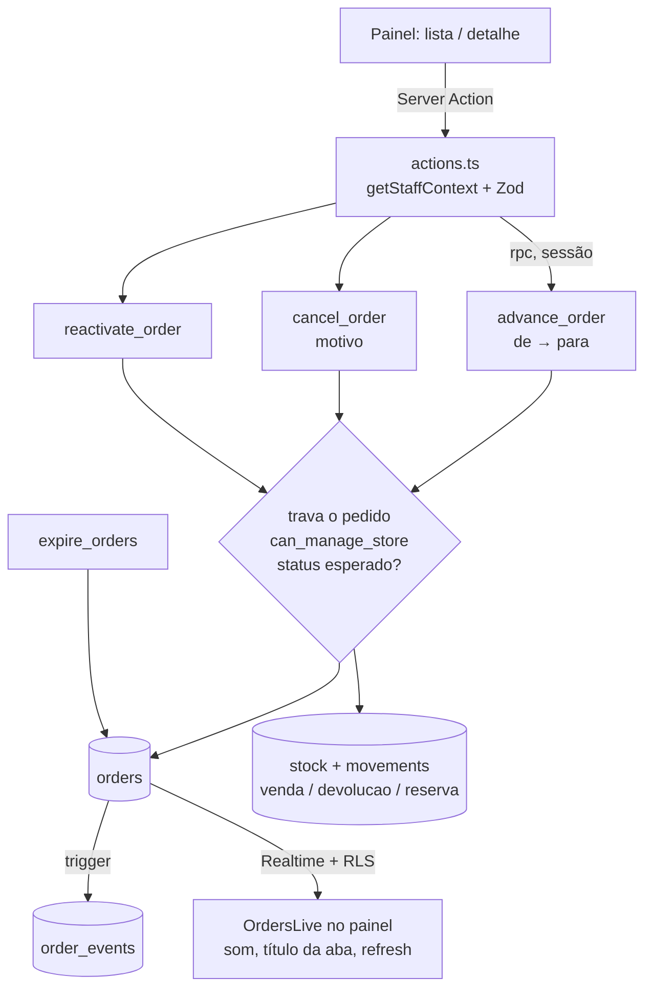

# 05 · Operação — Design

**Spec**: `.specs/features/05-operations/spec.md`
**Status**: Approved (2026-09-26)

---

## Architecture Overview

Mesma regra do estoque: **pedido só muda por função no banco**. Três funções `security definer` fazem todas as transições, travando a linha do pedido, conferindo a loja de quem chama (`can_manage_store`) e o status esperado, e mexendo no estoque na mesma transação. A política da etapa 01 que deixava o atendente dar `update` direto em `orders` é **removida** — hoje ela permitiria pular etapas por requisição forjada.

O histórico de status é gravado por **triggers** em `orders` (criação e toda mudança de status), então nenhum caminho — site, painel, cron de expiração — escapa do registro.

O alerta usa **Supabase Realtime** (`postgres_changes` em `orders`), que aplica o RLS de quem escuta: o atendente só recebe eventos da própria loja.

---

## Code Reuse Analysis

| Existente | Local | Uso |
|---|---|---|
| `can_manage_store`, padrão `security definer` + `search_path = ''` | migration 03 | Autorização por loja nas funções novas |
| Reserva atômica por produto em ordem | `create_order` (migration 04) | `reactivate_order` usa a mesma técnica e o mesmo `CK010` |
| `expire_orders` | migration 04 | Passa a ser executável por `authenticated` (lista chama antes de mostrar) |
| `getStaffContext`, `requireStaff`, `dbFailure` | `lib/auth.ts`, `lib/admin/common.ts` | Actions e páginas |
| `describeItem`, `describeFulfillment` | `lib/whatsapp.ts` | Itens e retirada/entrega no detalhe e na comanda |
| `formatDateTime`, `formatPickup`, `dayStartIso` | `lib/datetime.ts` | Filtro "Hoje" e horários em Campo Grande |
| `formatTaxId`, `formatWhatsapp`, `whatsappLink` | `lib/tax-id.ts`, `lib/phone.ts`, `lib/whatsapp.ts` | Detalhe e botão "WhatsApp do cliente" |
| `createClient` (browser) | `lib/supabase/browser.ts` | Assinatura do Realtime com a sessão do usuário |
| `StatusBadge`, `AdminShell` | `components/admin/` | UI |

---

## Data Model — migration `20261001000100_operations.sql`

### `order_events`

| Coluna | Tipo |
|---|---|
| `id` | bigint identity |
| `order_id` | uuid → `orders` (cascade) |
| `from_status` | `order_status` null (criação) |
| `to_status` | `order_status` |
| `actor_id` | uuid null (cliente ou sistema) |
| `actor_name` | text (`Cliente`, nome do staff, ou `Sistema` para expiração) |
| `note` | text null (motivo do cancelamento) |
| `created_at` | timestamptz |

RLS ligado; `select` para `authenticated` se o pedido é visível (`exists (select 1 from orders o where o.id = order_id)`, que já passa pelo RLS de `orders`). Sem escrita por API: só triggers. Grants explícitos (regra 8).

### Triggers

- `orders_log_insert` (after insert): evento `null → novo`, ator "Cliente".
- `orders_log_status` (after update of status, quando muda): evento `old → new`, ator = staff de `auth.uid()` ou "Sistema" se não houver sessão (cron); `note` = `cancel_reason` quando cancelado.

### Transições permitidas

| De | Para | Condição |
|---|---|---|
| `novo` | `confirmado` | — (reserva vira venda) |
| `confirmado` | `em_producao` | — |
| `confirmado` | `pronto`, `entregue` | só pedido sem encomenda |
| `em_producao` | `pronto` | — |
| `pronto` | `entregue` | — |
| `novo`, `confirmado`, `em_producao`, `pronto` | `cancelado` | só por `cancel_order` |
| `expirado` | `confirmado` | só por `reactivate_order` |

Espelhada em `lib/order-status.ts` (`nextStatuses`) para a tela oferecer só os botões válidos; o banco é a trava.

### Funções (`security definer`, `execute` só para `authenticated`)

| Função | Comportamento |
|---|---|
| `advance_order(p_order_id, p_from, p_to) → order_status` | `select … for update`; loja → 42501; status atual ≠ `p_from` → `CK020`; transição fora da tabela → `CK021`. Em `novo → confirmado`: `confirmed_at`, `handled_by`, `expires_at = null` e os movimentos `reserva` do pedido passam a `venda` (SPEC §5.5: "reserva vira venda no log"; `delta` e data preservados, a soma não muda). Demais: só o status e `handled_by` |
| `cancel_order(p_order_id, p_from, p_reason) → void` | Mesma trava e checagens; motivo obrigatório (1–200); devolve cada produto da vitrine com movimento `devolucao` (`quantity_after`, ator = staff); `cancelled_at`, `cancel_reason`, `handled_by` |
| `reactivate_order(p_order_id) → void` | Só `expirado`; reserva de novo por produto em ordem (`quantity ≥ q`), movimento `venda`; faltou algum → `CK010` com os ids e nada muda; status `confirmado`, `confirmed_at`, `handled_by`, `expires_at = null` |
| `expire_orders()` | Grant adicional para `authenticated` |

Remoção: `drop policy "staff updates orders"`.

### Realtime

`alter publication supabase_realtime add table public.orders` (guardado por `if exists`, para o check local sem a publicação).

---

## Components

### Lógica pura — `lib/order-status.ts`

`STATUS_LABELS`, `STATUS_TONES`, `nextStatuses(status, hasMadeToOrder)`, `canCancel(status)`, `CANCEL_REASONS`, `minutesLeft(expiresAt, now)`. Testes unitários.

### Consultas — `lib/admin/orders.ts` (server-only)

- `listOrders(supabase, { storeId?, status?, date })`: chama `expire_orders` antes; pedidos `novo` sempre + os da data (`created_at` no dia de Campo Grande); ordem: `novo` primeiro, depois mais recentes.
- `getOrder(supabase, id)`: pedido + loja + itens (`position`) + eventos.
- `getDashboard(supabase, storeId?)`: `novo` (a confirmar), contagem por status dos feitos hoje, "Saem hoje" (`scheduled_for` hoje, status `confirmado`/`em_producao`/`pronto`).

### Server Actions — `app/admin/(panel)/pedidos/actions.ts`

`advanceOrder(id, from, to)`, `cancelOrder(id, from, reason, note)`, `reactivateOrder(id)`. Zod nos limites; erros traduzidos:

| Código | Mensagem |
|---|---|
| `CK020` | "Este pedido mudou. Atualize a página." |
| `CK021` | "Essa mudança de status não é permitida." |
| `CK010` | "Não dá para reativar: acabou Fatia Karen, Copo Palha." (nomes a partir dos ids) |
| `42501` | "Pedido de outra loja." |

### Páginas

| Rota | Conteúdo |
|---|---|
| `/admin` | Início com o dia (substitui o placeholder do atendente; admin mantém os atalhos abaixo) |
| `/admin/pedidos?status&loja&data` | Lista com filtros (data padrão hoje) |
| `/admin/pedidos/[id]` | Detalhe, botões de status válidos, cancelar com motivo, reativar, WhatsApp do cliente, histórico |
| `/admin/pedidos/[id]/comanda` | Grupo de rotas sem a casca do painel; CSS de impressão (`@page`, 80 mm e A4); `window.print()` ao abrir; sem CPF/CNPJ |

### Client components

- `components/admin/orders-live.tsx` (montado no layout do painel): assina `postgres_changes` (`INSERT`/`UPDATE` em `orders`) com a sessão do usuário; a cada evento, `router.refresh()` (com espera de 1 s para juntar lotes); em `INSERT` de `novo`: soma não vistos, toca o som (Web Audio, sem arquivo) no máximo a cada 3 s se ativado, e muda o título da aba enquanto `document.hidden`. Status do canal → faixa "Reconectando…"; ao reconectar, `router.refresh()`. Preferência "alerta sonoro ativado" no `localStorage` (conveniência do aparelho).
- `components/admin/order-actions.tsx`: botões de avanço, diálogo de cancelamento (motivo + texto) e reativação; erro mostrado no lugar.

### Menu

"Pedidos" para admin e atendente, logo depois de "Início".

---

## Error Handling Strategy

| Cenário | Tratamento | O que a equipe vê |
|---|---|---|
| Duas pessoas no mesmo pedido | `CK020` (status esperado não bate) | "Este pedido mudou. Atualize a página." + recarrega |
| Transição inválida forjada | `CK021` | Mensagem; nada muda |
| Pedido de outra loja | RLS esconde na leitura; função → 42501 | "Pedido não encontrado" / "Pedido de outra loja." |
| Reativar sem estoque | `CK010` | Quais itens acabaram; pedido segue expirado |
| Realtime cai | Canal `CLOSED`/`CHANNEL_ERROR` | "Reconectando…"; refresh ao voltar |
| Som bloqueado pelo navegador | Só toca depois do toque em "Ativar" | Botão visível até ativar |

---

## Testes

| Tipo | Cobre |
|---|---|
| Unit | `nextStatuses` (com e sem encomenda), `canCancel`, `minutesLeft`, rótulos |
| PGlite | Transições válidas e inválidas (`CK021`); `p_from` diferente (`CK020`); confirmar troca `reserva` → `venda` sem mudar a soma; cancelar devolve e grava motivo; reativar reserva de novo e confirma; reativar sem estoque → `CK010` e nada muda; atendente de outra loja → 42501; atendente sem `update` direto em `orders`; eventos gravados em criação, mudanças e expiração (ator "Sistema"); anon sem acesso a `order_events`; soma dos movimentos = estoque |
| Integração (projeto real) | Duas confirmações simultâneas → uma vale, outra `CK020`; atendente da Loja 2 não lê pedidos nem eventos da Loja 1; **Realtime**: atendente da Loja 2 escutando recebe o pedido da Loja 2 e não o da Loja 1; limpeza |
| Navegador | Início e lista; pedido criado por script aparece sozinho com o título da aba; confirmar → produção → pronto → entregue; cancelar com motivo devolve estoque; reativar expirado; comanda sem CPF |

---

## Tech Decisions

| Decisão | Escolha | Motivo |
|---|---|---|
| Quem muda pedido | Só funções; política de `update` direto removida | Transições garantidas no banco (mesma lógica da regra 2) |
| Concorrência | `p_from` + `select … for update` | Segunda ação vê "mudou" em vez de sobrescrever |
| "Reserva vira venda" | `update` do `reason` dos movimentos do pedido | É o que o SPEC descreve; `delta`/data intactos, soma continua fechando |
| Histórico de status | Triggers em `orders` | Cobre site, painel e cron sem depender de cada caminho |
| Alerta | Realtime `postgres_changes` + RLS | Filtra por loja no servidor; sem polling |
| Som | Web Audio (bip gerado) | Sem arquivo de áudio; respeita a regra de autoplay com um toque |
| Comanda | Página própria com CSS de impressão | Funciona em impressora comum e térmica de 80 mm |
