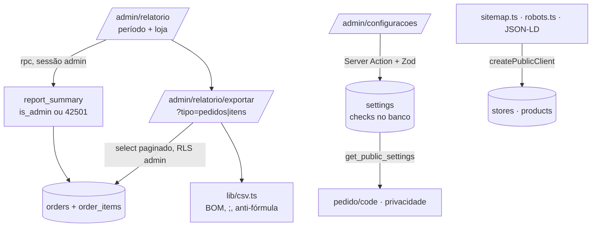

# 06 · Relatório e acabamento — Design

**Spec**: `.specs/features/06-report-finish/spec.md`
**Status**: Approved (2026-09-26)

---

## Architecture Overview

Três frentes independentes, cada uma pequena:

1. **Relatório**: uma função no banco (`report_summary`) agrega tudo de uma vez: resumo, por dia, por loja e mais vendidos. Assim a tela recebe poucos números, mesmo para um ano, e a regra de faturamento (AD-011) fica num lugar só. A função é `security definer`, só admin (senão 42501), e converte datas para Campo Grande no próprio SQL. O **CSV** sai de uma rota do painel que lê pedidos e itens com a sessão do admin (RLS já libera tudo para admin), em páginas de 1000 linhas, e monta o arquivo com um formatador puro testado.
2. **Configurações**: a tabela `settings` (linha única) já existe com política de `update` só para admin. Entram: coluna `privacy_reviewed`, checks no banco (faixa da reserva; modelo com `{codigo}` e `{itens}`) e o rascunho da política. A tela usa `useAdminForm` e mostra a prévia com o mesmo `renderOrderMessage` que o site usa.
3. **SEO e acabamento**: arquivos de metadados do App Router (`sitemap.ts`, `robots.ts`, `opengraph-image.tsx`), JSON-LD gerado por funções puras, `metadataBase` a partir de `NEXT_PUBLIC_SITE_URL` e uma página 404 da marca. Revisão mobile e Lighthouse são verificação, com correções pontuais.



---

## Code Reuse Analysis

| Existente | Local | Uso |
|---|---|---|
| `requireAdmin`, `getAdminContext`, `NOT_ALLOWED` | `lib/auth.ts` | Páginas, action e rota do CSV só para admin |
| `useAdminForm`, `<form key={round}>`, `values` no erro | `components/admin/`, regra 10 | Formulário de configurações |
| `renderOrderMessage`, `describeItem` | `lib/whatsapp.ts` | Prévia do modelo; coluna "opções" do CSV de itens |
| `todayInCampoGrande`, `dayStartIso`, `formatDateTime` | `lib/datetime.ts` | Períodos e datas do CSV |
| `formatBRL` | `lib/money.ts` | Valores na tela |
| `getPublicSettings`, `getProductPage`, `listStores` | `lib/storefront.ts`, `lib/catalog.ts` | Privacidade, JSON-LD, sitemap |
| `publicEnv().siteUrl` | `lib/env.ts` | `metadataBase`, sitemap, robots, JSON-LD (já obrigatório e validado) |
| `productImageUrl` | `lib/images.ts` | Imagem do `Product` e Open Graph do produto |
| Padrão `security definer` + `search_path = ''` + `is_admin()` | migrations 01–05 | `report_summary` |

---

## Data Model — migration `20261002000100_report_settings.sql`

### `settings`

| Mudança | Detalhe |
|---|---|
| `privacy_reviewed boolean not null default false` | Tira o selo "Texto provisório" quando `true` |
| Check `reservation_minutes between 15 and 1440` | Substitui o `> 0` atual (seed usa 120) |
| Check do modelo | `position('{codigo}' in …) > 0 and position('{itens}' in …) > 0` e até 2000 caracteres. Variável desconhecida é recusada só na aplicação (lista em `lib/whatsapp.ts`) |
| Check `privacy_text` até 20000 caracteres | Limite de entrada |
| Rascunho da política | `update … set privacy_text = <rascunho> where privacy_text = ''` na migration **e** no `seed.sql` (L-009: o seed roda depois da migration num banco novo) |

`get_public_settings()` passa a devolver `privacy_reviewed`. Grants: nada novo na tabela (política de admin já existe).

### `report_summary(p_from date, p_to date, p_store_id uuid default null) → jsonb`

`security definer`, `stable`, `execute` só para `authenticated`. Não é admin → 42501. `p_from > p_to` ou intervalo acima de 400 dias → `CK011`.

Filtro: `(o.created_at at time zone 'America/Campo_Grande')::date between p_from and p_to` e loja quando informada. "Confirmados" = `status in ('confirmado','em_producao','pronto','entregue')`.

```json
{
  "totals":   { "orders": 12, "revenue_cents": 45600, "avg_ticket_cents": 3800,
                "cancelled": { "count": 1, "cents": 2490 },
                "expired":   { "count": 2, "cents": 4980 },
                "pending":   { "count": 1, "cents": 1200 } },
  "by_day":   [{ "day": "2026-09-26", "orders": 5, "revenue_cents": 18000 }],
  "by_store": [{ "store_id": "…", "name": "Loja 1", "orders": 7, "revenue_cents": 26000, "avg_ticket_cents": 3714 }],
  "top_products": [{ "product_id": "…", "name": "Fatia Karen", "type": "vitrine",
                     "units": 31, "kg": null, "revenue_cents": 77190 }]
}
```

- `avg_ticket_cents` = `round(revenue / orders)`, `null` com zero pedidos.
- `by_day` só com dias que tiveram pedido (a tela preenche os dias vazios).
- `top_products`: itens de pedidos confirmados, agrupados por `product_id` (ou por `name_snapshot` se o produto não existe mais), nome atual quando existe. `units` = soma de `qty`, exceto `bolo_kg`, que conta 1 por item (cada item é um bolo); `kg` = soma de `options->>'weight_kg'` para `bolo_kg`. Ordem: unidades, depois valor. Limite 10.

---

## Components

### Lógica pura (unit tests)

| Arquivo | Conteúdo |
|---|---|
| `lib/report.ts` | `PERIOD_PRESETS` (`hoje`, `7d`, `mes`, `mes_passado`, `personalizado`); `resolvePeriod(preset, from?, to?, today)` → `{ from, to }` em `YYYY-MM-DD` (7 dias = hoje e os 6 anteriores; personalizado inválido cai no mês atual com aviso); `fillDays(byDay, from, to)` para a tabela diária |
| `lib/csv.ts` | `toCsv(header, rows)`: BOM + `;` + `\r\n`; aspas quando há `;`, `"` ou quebra de linha; célula começando com `=`, `+`, `-`, `@`, tab ou CR recebe `'` na frente; `csvCents(1234_50)` → `1234,50`; `csvDateTime(iso)` → `dd/mm/aaaa hh:mm` em Campo Grande |
| `lib/whatsapp.ts` (+) | `TEMPLATE_VARIABLES` (nome → descrição), `templateProblems(template)` → variáveis obrigatórias ausentes e desconhecidas; `SAMPLE_ORDER` para a prévia |
| `lib/structured-data.ts` | `bakeryJsonLd(store, siteUrl)` com `openingHoursSpecification` a partir de `hours`; `productJsonLd(product, siteUrl)` com `Offer` em BRL (`price` em reais), `availability` `InStock`/`OutOfStock` para vitrine (em alguma loja), sem `availability` para encomenda; `jsonLdScript(data)` escapa `<` |
| `lib/validation/settings.ts` | Zod: reserva inteira 15–1440; modelo 1–2000 sem problemas de `templateProblems`; privacidade até 20000; `privacy_reviewed` checkbox |

### Consultas e rotas do painel (server-only)

- `lib/admin/report.ts`: `getReport(supabase, period, storeId?)` (rpc); `exportOrders` / `exportItems` (select com `.range()` em páginas de 1000, ordem `created_at, id`) → linhas prontas para `toCsv`.
- `app/admin/(panel)/relatorio/page.tsx`: `requireAdmin`; filtros por `searchParams` (`periodo`, `de`, `ate`, `loja`) num `<form method="get">` (sem JS); cartões do resumo; tabela por dia com barra (`width` proporcional); divisão por loja quando "Todas"; mais vendidos; botões de exportação apontando para a rota com os mesmos filtros.
- `app/admin/(panel)/relatorio/exportar/route.ts` (`GET ?tipo=pedidos|itens&…`): `getAdminContext` (não admin → 403); Zod nos parâmetros; `Content-Type: text/csv; charset=utf-8`, `Content-Disposition: attachment; filename="cake67-pedidos-2026-09-01-a-2026-09-30.csv"`, `Cache-Control: no-store`.

Colunas do CSV de pedidos: Número; Feito em; Loja; Status; Cliente; WhatsApp; CPF/CNPJ; Retirada/entrega; Marcado para; Endereço; Subtotal; Motivo do cancelamento; Confirmado por. Itens: Número; Feito em; Loja; Status; Produto; Tipo; Quantidade; Opções; Valor unitário; Total.

### Configurações

- `app/admin/(panel)/configuracoes/page.tsx` (`requireAdmin`) + `settings-form.tsx` (client, `useAdminForm`): três blocos (Reserva · Mensagem do WhatsApp · Privacidade). A mensagem tem a lista de variáveis (tocar insere no cursor), a prévia ao vivo (`renderOrderMessage(template, SAMPLE_ORDER, reserva)`) e o erro de `templateProblems` antes de enviar. Privacidade: textarea + "Texto revisado pela Cake 67" + selo "Texto provisório" enquanto desmarcado.
- `app/admin/(panel)/configuracoes/actions.ts`: `saveSettings` → Zod → `update … eq('id', 1).select('id')` com a sessão (0 linhas → `NOT_ALLOWED`); checks do banco traduzidos (`23514` → "Revise os campos destacados").
- `/privacidade`: texto do banco; selo só se `!privacy_reviewed`; o texto provisório fixo no código sai (vai para o banco como rascunho). Texto vazio → "Fale com a loja pelo WhatsApp para saber como tratamos seus dados."

### Menu

Admin: "Relatório" depois de "Pedidos"; "Configurações" no fim. Atendente: sem mudança.

### SEO

| Arquivo | Conteúdo |
|---|---|
| `app/layout.tsx` | `metadataBase: new URL(siteUrl)`, `openGraph` padrão (`siteName`, `locale: pt_BR`, `type: website`) |
| `app/opengraph-image.tsx` | `ImageResponse` 1200×630 com as cores da marca, o logo (`public/brand`, lido do disco) e "Confeitaria em Campo Grande". Sem fonte externa (L-011) |
| `app/sitemap.ts` | Home, cardápio, encomendas, privacidade + `/produto/<slug>` dos produtos ativos com preço definido (`createPublicClient`); `lastModified` do produto |
| `app/robots.ts` | `VERCEL_ENV === 'production'`: libera `/`, bloqueia `/admin`, `/carrinho`, `/checkout`, `/pedido`, aponta o sitemap. Qualquer outro ambiente: `disallow: /` |
| Home | `<script type="application/ld+json">` com um `Bakery` por loja ativa |
| Produto | `productJsonLd`; `generateMetadata` com `openGraph.images` = capa e `alternates.canonical` |
| Privacidade, cardápio, encomendas | Descrição própria (as duas últimas já têm) |

`JsonLd` é um componente de servidor mínimo que usa `jsonLdScript`.

### 404

`components/site/not-found-panel.tsx` (logo, "Não encontramos esta página", botões "Ver cardápio" e "Início") usado por `app/not-found.tsx` (rotas inexistentes, fora do layout do site) e `app/(site)/not-found.tsx` (produto inativo, pedido sem token), para os dois terem a mesma cara.

### Revisão mobile e desempenho

Sem componente novo. Roteiro em 360 px: home, cardápio, produto, encomendas, carrinho, checkout, pedido, privacidade, 404; painel: início, pedidos, detalhe, estoque, contagem, produtos, relatório, configurações. Correções pontuais no que quebrar. Imagens: conferir `sizes` e `priority` só na primeira dobra.

Lighthouse: o preview da Vercel exige login (Vercel Authentication), então a medição roda contra o **build de produção local** (`npm run build && npm start`) com `npx lighthouse --form-factor=mobile` nas 4 páginas; o preview confere que as rotas respondem.

---

## Error Handling Strategy

| Cenário | Tratamento | O que a pessoa vê |
|---|---|---|
| Atendente abre relatório ou configurações | `requireAdmin` | "Sem permissão" |
| Atendente chama `report_summary` ou a rota do CSV direto | 42501 / HTTP 403 | Nada é devolvido |
| Período invertido ou longo demais | `resolvePeriod` corrige na tela; `CK011` no banco | "Escolha um período de até 400 dias." |
| Modelo sem `{codigo}`/`{itens}` ou com variável desconhecida | Zod (e check no banco) | Erro no campo, texto preservado |
| Reserva fora da faixa | Zod + check | "Entre 15 e 1440 minutos." |
| Falha ao montar o CSV | Rota devolve 500 sem arquivo parcial | Mensagem do navegador; a página continua |

---

## Testes

| Tipo | Cobre |
|---|---|
| Unit | `resolvePeriod` (virada de mês e de ano, 7 dias, personalizado inválido); `fillDays`; `toCsv` (BOM, `;`, aspas, quebra de linha, anti-fórmula, centavos, data em Campo Grande); `templateProblems`; `bakeryJsonLd` (horários) e `productJsonLd` (preço em reais, disponibilidade); schema de configurações |
| PGlite | `report_summary`: totais com confirmado/cancelado/expirado/novo, pedido às 23h30 de Campo Grande cai no dia local, filtro por loja, bolo kg conta 1 e soma kg, produto apagado usa o nome guardado; atendente → 42501; anon sem `execute`; `CK011`. `settings`: checks recusam reserva 10 e modelo sem `{itens}`; atendente não atualiza; `get_public_settings` traz `privacy_reviewed`. Checks das etapas 01–05 passando |
| Integração (projeto real) | Pedidos de teste em duas lojas com datas ajustadas para um dia fixo no passado, um cancelado e um expirado → `report_summary` bate com a conta à mão; atendente recebe 42501; limpeza |
| Navegador | Relatório com filtros e estado vazio; os dois CSVs baixados abrem com acentos e CPF; configurações: prévia ao vivo, erro de variável, mudança do modelo aparece no próximo pedido; privacidade com e sem selo; `sitemap.xml`, `robots.txt`, JSON-LD; 404; roteiro 360 px; Lighthouse mobile |

---

## Tech Decisions

| Decisão | Escolha | Motivo |
|---|---|---|
| Onde agregar | Função SQL única | Período longo continua rápido; regra de faturamento num lugar só; testável no PGlite |
| Data do relatório | `created_at` em Campo Grande | AD-011 (mesma regra do "Hoje") |
| CSV | Rota do painel + formatador puro, sem biblioteca | Formato simples; controle de BOM, `;` e anti-fórmula |
| Limite de linhas do PostgREST | Paginação de 1000 | Exportar mais que o limite padrão da API sem mudar configuração do projeto |
| Validação do modelo | Zod (variáveis conhecidas) + check no banco (obrigatórias) | O banco garante que o pedido sempre tem número e itens na mensagem |
| Rascunho de privacidade | No banco (migration + seed), não no código | Editável no painel; um lugar só |
| Robots em preview | `disallow: /` fora de produção | Preview não pode ser indexado |
| Lighthouse | Build local de produção | Preview protegido por login da Vercel |
| Gráficos | Barras em CSS | Sem dependência nova (fora do escopo) |
