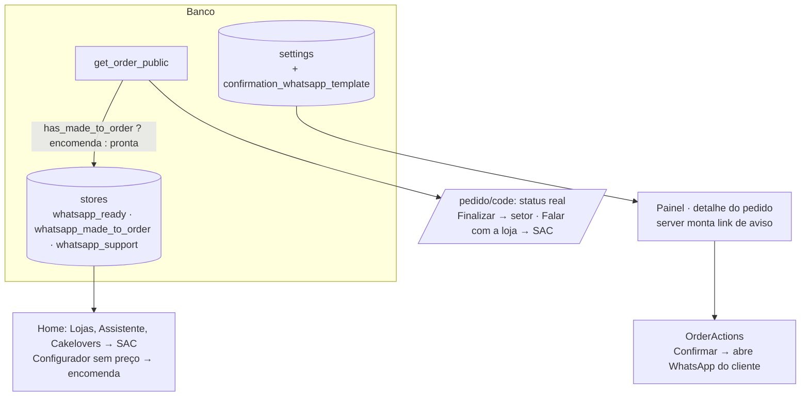

# 08 · WhatsApp por setor e aviso de confirmação — Design

**Spec**: `.specs/features/08-whatsapp-sectors/spec.md`
**Status**: Approved (2026-09-28, "aprovado, pode seguir")

---

## Architecture Overview

Três mudanças independentes que se encontram na página do pedido:

1. **Banco**: `stores` troca `whatsapp` por três colunas; `get_order_public` escolhe o número do setor (a regra D1 mora no banco, num lugar só); `settings` ganha o modelo da mensagem de confirmação.
2. **Painel**: o formulário de Lojas edita os três números; o detalhe do pedido monta o link de aviso no servidor e o botão **Confirmar** abre o WhatsApp do cliente quando a confirmação dá certo.
3. **Site**: contato público passa a ser o SAC; a página `/pedido/[code]` mostra o status real.



---

## Banco · migration `20261004000100_whatsapp_sectors.sql`

```sql
alter table public.stores
  add column whatsapp_ready text,
  add column whatsapp_made_to_order text,
  add column whatsapp_support text;

-- Numbers given by the client on 2026-09-28 (spec 08).
update public.stores set whatsapp_ready = '5567998272300', whatsapp_made_to_order = '5567981519796',
  whatsapp_support = '5567993285925' where slug = 'estiva';
update public.stores set whatsapp_ready = '5567999873946', whatsapp_made_to_order = '5567996258783',
  whatsapp_support = '5567996197916' where slug = 'afonso-pena';
-- Any other store keeps its single number in every sector until edited.
update public.stores set whatsapp_made_to_order = coalesce(whatsapp_made_to_order, whatsapp_ready),
  whatsapp_support = coalesce(whatsapp_support, whatsapp_ready);

alter table public.stores
  alter column whatsapp_made_to_order set not null,
  alter column whatsapp_support set not null,
  add constraint stores_whatsapp_made_to_order_check check (whatsapp_made_to_order ~ '^55[0-9]{10,11}$'),
  add constraint stores_whatsapp_support_check check (whatsapp_support ~ '^55[0-9]{10,11}$');
```

- As três colunas têm o mesmo check de formato (`^55[0-9]{10,11}$`).
- **Grants**: nada novo. `anon` já tem `select` na tabela `stores` inteira e as colunas novas entram nela. Os números dos setores continuam legíveis pela API pública; D2 é sobre o que o site **mostra**, não é segredo (os números já circulam no cardápio).
- `get_order_public` (`create or replace`, mesma assinatura): o objeto `store` passa a ser
  `{ name, address, whatsapp: <setor pela regra D1>, support_whatsapp }`. Manter a chave `whatsapp` evita mexer em `OrderSummary`, `renderOrderMessage` e no teste de mensagem.
- `settings`:
  ```sql
  alter table public.settings
    add column confirmation_whatsapp_template text not null default E'Olá, {nome}! Seu pedido *{codigo}* foi confirmado pela Cake 67.\n{entrega}\nLoja: {loja}\n\nAcompanhe aqui: {link}',
    add constraint settings_confirmation_template_check check (
      char_length(confirmation_whatsapp_template) <= 2000
      and position('{codigo}' in confirmation_whatsapp_template) > 0
      and position('{link}' in confirmation_whatsapp_template) > 0
    );
  ```
  Fica fora de `get_public_settings`: só o painel usa.
- `seed.sql`: seis números novos, tira o comentário `PROVISIONAL WhatsApp` e o default da coluna cobre o modelo.
- `lib/database.types.ts` atualizado à mão (regra do CLAUDE.md).

---

## Código

| Arquivo | Mudança |
|---|---|
| `lib/validators/store.ts` | `whatsappField(label)` reaproveita o transform atual; schema com `whatsapp_ready`, `whatsapp_made_to_order`, `whatsapp_support` |
| `app/admin/(panel)/lojas/store-form.tsx`, `stores-list.tsx` | Três campos ("Pronta entrega", "Encomenda", "SAC") e três linhas na lista |
| `lib/catalog.ts` `listStores` | Seleciona `whatsapp_made_to_order, whatsapp_support` (sem `whatsapp_ready`: o site não mostra) |
| `lib/storefront.ts` `CheckoutStore` | Remove `whatsapp` (ninguém usa no carrinho/checkout) |
| `app/(site)/page.tsx` | `firstWhatsapp` → `stores[0].whatsapp_support` (assistente e Cakelovers) |
| `components/site/home/stores-section.tsx` | Mostra e liga para `whatsapp_support`, rótulo "WhatsApp (SAC)" |
| `components/site/home/home-builder.tsx` | `BuilderStore.whatsapp` recebe `whatsapp_made_to_order` (D3) |
| `lib/whatsapp.ts` | `OrderSummary.store.support_whatsapp`; `renderConfirmationMessage`; `templateProblems` passa a receber as variáveis e as obrigatórias de cada modelo |
| `lib/order-status.ts` | `publicStatus(status, fulfillment)` → `{ title, text }` para a página do cliente; `NOTIFY_STATUSES` (confirmado, em_producao, pronto, entregue) |
| `app/(site)/pedido/[code]/page.tsx` | Título e texto por `publicStatus`; "Finalizar no WhatsApp" só em `novo`; "Falar com a loja" (SAC) em cancelado/expirado |
| `lib/validators/settings.ts`, `configuracoes/*` | Segundo modelo com prévia (mesmo componente/estilo do primeiro), validado com `{codigo}` e `{link}` |
| `app/admin/(panel)/pedidos/[id]/page.tsx` | Lê o modelo, monta `notifyHref` no servidor e passa para `OrderActions` |
| `components/admin/orders/order-actions.tsx` | Abre o WhatsApp ao confirmar; botão "Avisar cliente no WhatsApp" |

### Mensagem de confirmação

Variáveis: `{codigo}`, `{nome}`, `{loja}` (nome · endereço), `{entrega}`, `{link}`. Sem valores (o subtotal pode mudar com taxa de entrega combinada no WhatsApp).

`{entrega}` usa uma função nova `describeConfirmedFulfillment`: "Retirada em sáb., 04/10 às 15:00", "Entrega em …", ou "Retirada na loja" (vitrine sem data). A `describeFulfillment` atual fala em "retirada em até 2 h", que é a regra da reserva e não serve depois de confirmado.

`{link}` = `${siteUrl()}/pedido/${code}?t=${public_token}`. O painel já lê `public_token` (`getOrder` seleciona `*`, RLS por loja). O token só vai para a mensagem do próprio cliente.

### Abrir o WhatsApp sem ser bloqueado

`window.open` depois de um `await` é bloqueado como pop-up. No clique em **Confirmar** (e em **Reativar e confirmar**):

1. Abre uma aba vazia **no mesmo gesto**: `const tab = window.open("", "_blank")`.
2. Roda a Server Action.
3. Deu certo → `tab.opener = null; tab.location.href = notifyHref`. Falhou → `tab.close()` (critério 4).
4. Se `tab` veio `null` (bloqueado mesmo assim), nada quebra: o botão "Avisar cliente no WhatsApp" aparece no detalhe depois do refresh.

O botão "Avisar cliente no WhatsApp" é um `<a href target="_blank" rel="noopener noreferrer">` comum, visível quando o status está em `NOTIFY_STATUSES`.

No celular (Android/iOS), a aba nova vira o app do WhatsApp; o painel continua na aba original.

### Página do cliente

| Status | Título | Texto |
|---|---|---|
| novo | Pedido recebido | (como hoje) + Finalizar no WhatsApp |
| confirmado | Pedido confirmado | A loja confirmou seu pedido. Qualquer dúvida, fale com ela pelo WhatsApp. |
| em_producao | Em produção | Seu pedido está sendo preparado. |
| pronto | Pronto para retirar / Pronto para entrega | Pode passar na loja / A loja vai combinar a entrega. |
| entregue | Pedido entregue | Obrigado por pedir na Cake 67! |
| cancelado | Pedido cancelado | (como hoje) + Falar com a loja (SAC) |
| expirado | Reserva expirada | (como hoje) + Falar com a loja (SAC) |

Nos status depois de `novo`, o link de contato é o SAC da loja.

---

## Testes

- **Unit**: `renderConfirmationMessage` (variáveis, sem valores), `templateProblems` para os dois modelos, `describeConfirmedFulfillment`, `publicStatus` (todos os status × retirada/entrega), `storeSchema` com os três campos.
- **Integration**: `get_order_public` devolve Pronta entrega para pedido só de vitrine e Encomenda para pedido misto, com `support_whatsapp`; `settings` recusa modelo de confirmação sem `{link}`; `anon` continua sem ler `orders`.

## Riscos

- **Deploy** (revisado na implementação): a suíte de integração roda contra o projeto real, então a migration vai antes do merge. Por isso ela **não renomeia** `stores.whatsapp`: adiciona as três colunas e deixa `whatsapp` anulável, fora dos tipos e sem uso no código novo. O site no ar continua funcionando entre o `db push` e o merge. Uma migration seguinte, depois do merge, apaga a coluna.
