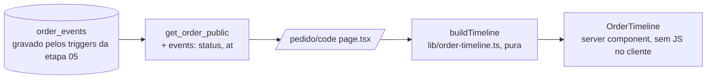

# 09 · Linha do tempo na página do pedido — Design

**Spec**: `.specs/features/09-order-timeline/spec.md`
**Status**: Approved (2026-09-28, "aprovado, pode seguir")

---

## Architecture Overview



Três peças: o banco passa a devolver o histórico público, uma função pura monta as etapas e um componente de servidor desenha a lista. Sem estado no cliente.

---

## Banco · migration `20261006000100_order_timeline.sql`

`create or replace function public.get_order_public` (mesma assinatura, mesmos grants) com uma chave nova:

```sql
'events', (
  select coalesce(jsonb_agg(jsonb_build_object('status', e.to_status, 'at', e.created_at) order by e.id), '[]'::jsonb)
  from public.order_events e where e.order_id = v_order.id
)
```

Só `to_status` e `created_at`: `actor_name`, `actor_id`, `from_status` e `note` (motivo do cancelamento) ficam de fora. Nenhuma tabela nova, nenhum grant novo.

O histórico é completo desde a etapa 05: `log_order_insert` grava o `novo` e `log_order_status` grava toda mudança (incluindo expiração e reativação).

---

## `lib/order-timeline.ts`

```ts
export type OrderEvent = { status: OrderStatus; at: string };
export type TimelineStep = { key: OrderStatus; label: string; state: "done" | "current" | "upcoming"; at: string | null };
export type TimelineEnd = { label: string; at: string | null } | null; // cancelado / expirado

export function buildTimeline(order: {
  status: OrderStatus; created_at: string; has_made_to_order: boolean;
  fulfillment: "retirada" | "entrega"; events: OrderEvent[];
}): { steps: TimelineStep[]; end: TimelineEnd }
```

Regras:

1. **Caminho** (D1): `novo, confirmado, [em_producao se has_made_to_order], pronto, entregue`.
2. **Rótulos**: Pedido recebido · Confirmado · Em produção · Pronto para retirar / Pronto para entrega · Retirado / Entregue.
3. **Até onde chegou**:
   - status ativo (novo…entregue): índice do status atual no caminho;
   - cancelado/expirado: o maior índice do caminho que tem evento. Como `advance_order` só anda para frente e a reativação vai para `confirmado`, "o maior índice com evento" é exatamente onde o pedido parou.
4. **Estado de cada etapa**: antes do alcançado → `done`; o alcançado → `current` (ativo) ou `done` (terminal); depois → `upcoming` (ativo) ou omitido (terminal, D3).
5. **Horário** (D5): último evento com aquele status; `novo` usa `created_at`. Etapa `done` sem evento (pulada, D2) fica com `at: null`.
6. **Fim** (D3): cancelado → "Pedido cancelado", expirado → "Reserva expirada", com o horário do último evento desse status.
7. **Reativado** (D4) sai naturalmente: status atual `confirmado`, a expiração não está no caminho e não vira `end`.

Teste unitário cobre cada regra (tabela na seção Testes).

---

## `components/site/order-timeline.tsx`

Server component, `<ol aria-label="Andamento do pedido">`:

- Cada etapa é um `<li>` com um marcador à esquerda e uma linha vertical ligando ao próximo (pseudo-elemento, some no último).
- `done`: marcador cheio `bg-olive` com ✓ (`aria-hidden`), texto `text-cocoa`, horário `text-cocoa-soft text-sm`.
- `current`: marcador com anel `ring-4 ring-olive/20`, texto `font-medium text-olive`, `aria-current="step"`.
- `upcoming`: marcador vazio `border-cocoa/25`, texto `text-cocoa/45`.
- `end`: marcador `bg-raspberry`, texto `text-raspberry`, é o `current` da lista.
- Horário com `formatPickup` (`"28/09 às 18h01"`), já em Campo Grande.
- Texto para leitor de tela por etapa: `<span class="sr-only">concluída</span>` / `em andamento` / `próxima`.

Mesma lista vertical no celular e no desktop (a coluna da página já é `max-w-2xl`). Sem animação.

## Página

`app/(site)/pedido/[code]/page.tsx`: `<OrderTimeline timeline={buildTimeline(order)} />` entre o botão do WhatsApp e o cartão do resumo. `PublicOrder` ganha `events: OrderEvent[]`.

---

## Testes

**Unit** (`tests/unit/order-timeline.test.ts`):

| Caso | Esperado |
|---|---|
| vitrine `novo` | 4 etapas; Recebido current; resto upcoming |
| vitrine confirmado → entregue direto | Pronto `done` com `at: null`; Retirado current |
| encomenda `em_producao` | 5 etapas; Em produção current |
| entrega `pronto` | "Pronto para entrega"; final "Entregue" |
| confirmado → cancelado | Recebido e Confirmado done; end "Pedido cancelado" com horário; sem upcoming |
| novo → expirado | Recebido done; end "Reserva expirada" |
| novo → expirado → confirmado (C67-000076) | Recebido done, Confirmado current com o horário da reativação; sem end |

**Integration** (`tests/integration/whatsapp.test.ts` vira o arquivo do pedido público, ou um novo `order-timeline.test.ts`): `get_order_public` traz `events` com só `status` e `at`, na ordem, e nenhum `actor_name`/`note`.

## Riscos

Nenhum de deploy: a migration só acrescenta uma chave no JSON, o código no ar ignora.
