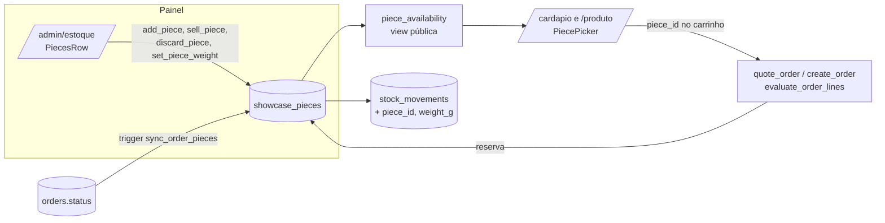

# 10 · Bolo inteiro por peso na vitrine — Design

**Spec**: `.specs/features/10-weighed-cakes/spec.md`
**Status**: Approved (2026-09-29, "aprovado, pode seguir")

---

## Architecture Overview



Uma tabela nova de peças, uma view pública só com as disponíveis, quatro funções do painel e um trigger em `orders` que acompanha o pedido (expira, cancela, reativa, entrega). O contador `stock` continua só para `vitrine`.

**Por que trigger para os estados do pedido:** `expire_orders`, `cancel_order`, `reactivate_order` e `advance_order` mudam o status em lugares diferentes. Um trigger `after update of status` cobre todos (inclusive caminhos futuros) sem copiar quatro funções grandes, e roda na mesma transação: se a reativação não conseguir reservar a peça, ele levanta `CK010` e a reativação inteira desfaz, como já acontece com o contador. A reserva na criação fica explícita em `create_order`, que precisa mudar de qualquer jeito.

---

## Banco

### Migration 1 · `20261007000100_weighed_cakes_enums.sql`

Separada porque valor novo de enum só pode ser usado depois do commit (o `db push` roda cada arquivo numa transação).

```sql
alter type public.product_type add value 'vitrine_kg';
alter type public.stock_reason add value 'descarte';
alter type public.stock_reason add value 'correcao_peso';
create type public.piece_status as enum ('disponivel', 'reservado', 'vendido', 'descartado');
```

### Migration 2 · `20261007000200_weighed_cakes.sql`

**Tabela**

```sql
create table public.showcase_pieces (
  id uuid primary key default gen_random_uuid(),
  product_id uuid not null references public.products (id) on delete cascade,
  store_id uuid not null references public.stores (id) on delete cascade,
  weight_g integer not null check (weight_g between 300 and 10000),
  status public.piece_status not null default 'disponivel',
  order_id uuid references public.orders (id) on delete set null,
  created_at timestamptz not null default now(),
  updated_at timestamptz not null default now(),
  check ((status = 'reservado') = (order_id is not null) or status = 'vendido')
);
create index showcase_pieces_available_idx on public.showcase_pieces (store_id, product_id) where status = 'disponivel';
create index showcase_pieces_order_idx on public.showcase_pieces (order_id) where order_id is not null;
-- trigger set_updated_at (já existe)
```

Venda no balcão fica `vendido` sem `order_id`; venda por pedido fica `vendido` com `order_id`.

**Colunas novas**

- `order_items.piece_id uuid references showcase_pieces on delete set null`: liga o item à peça (o peso também vai em `options.weight_g` para o painel, WhatsApp e CSV, que já leem `options`).
- `stock_movements.piece_id uuid references showcase_pieces on delete set null`, `stock_movements.weight_g integer`.
- `stock_movements` troca o check `delta <> 0` por `delta <> 0 or reason = 'correcao_peso'` (correção não muda a quantidade).

Nas linhas de peça: `delta` = +1 (entrada, devolução) ou −1 (reserva, venda no balcão, descarte), 0 na correção; `quantity_after` = quantas peças daquele produto estão disponíveis na loja depois da mudança. Assim o histórico da etapa 03 continua fazendo sentido.

Tradução no histórico (`reason` + contexto):

| Ação | reason | delta | order_id |
|---|---|---|---|
| Adicionar bolo | `ajuste` | +1 | — |
| Vendida no balcão | `venda` | −1 | — |
| Descartar | `descarte` | −1 | — |
| Corrigir peso | `correcao_peso` | 0 | — |
| Pedido criado | `reserva` | −1 | pedido |
| Expirou / cancelado | `devolucao` | +1 | pedido |
| Reativado | `venda` | −1 | pedido (igual ao contador hoje) |
| Entregue | nenhuma linha (a peça já saiu da vitrine na reserva) | | |

**RLS e grants** (regras 3 e 8)

```sql
alter table public.showcase_pieces enable row level security;
create policy "staff reads pieces" on public.showcase_pieces
  for select to authenticated
  using ((select public.is_admin()) or store_id = (select public.staff_store()));
grant select on public.showcase_pieces to authenticated;
grant all on public.showcase_pieces to service_role;
```

Sem política de escrita: peça só muda pelas funções (regra 2). Anon não tem grant na tabela.

**View pública** (mesmo padrão de `product_availability`)

```sql
create view public.piece_availability with (security_invoker = false) as
select c.id, c.product_id, c.store_id, c.weight_g, c.created_at
from public.showcase_pieces c
join public.products p on p.id = c.product_id
where c.status = 'disponivel' and p.active and not p.price_pending and p.type = 'vitrine_kg'
  and (cardinality(p.store_ids) = 0 or c.store_id = any(p.store_ids));
grant select on public.piece_availability to anon, authenticated;
```

Sem preço na view: o site calcula para exibir (`price_cents × weight_g / 1000`), e o banco recalcula na cotação e no pedido (regra 1).

**Funções do painel** (todas `security definer`, `search_path = ''`, grant só para `authenticated`)

| Função | Faz |
|---|---|
| `add_piece(p_product_id, p_store_id, p_weight_g) returns uuid` | `can_manage_store`; produto existe e é `vitrine_kg` (`CK004`); peso na faixa (`CK031`); cria `disponivel`; movimento |
| `sell_piece(p_piece_id)` | trava a peça; `disponivel` → `vendido`; movimento |
| `discard_piece(p_piece_id)` | `disponivel` → `descartado`; movimento |
| `set_piece_weight(p_piece_id, p_weight_g)` | só `disponivel`; faixa; movimento com o peso novo |

Helper interno `piece_lock(p_piece_id) returns showcase_pieces`: `select ... for update`, confere `can_manage_store` (senão `42501`) e `status = 'disponivel'` (senão `CK030`, "Esse bolo mudou, atualize a lista"). Helper interno `piece_log(piece, reason, delta, order_id, actor)`: grava o movimento com `quantity_after` contado.

**Pedido** (`create or replace`, mesma assinatura e grants)

- `evaluate_order_lines`: ramo novo para `vitrine_kg`. Item `{ product_id, qty: 1, piece_id }`.
  - `piece_id` inválido, de outro produto ou de outra loja → `indisponivel`.
  - Peça não `disponivel` → `esgotado`, "Esse bolo acabou de ser reservado, escolha outro peso".
  - A mesma peça duas vezes no carrinho ou `qty <> 1` → `invalido`.
  - Preço: `round(price_cents * weight_g / 1000.0)`; `options = { piece_id, weight_g }`; `lead_time_hours = 0`.
- `quote_order` e `create_order`: o filtro de encomenda passa de `type <> 'vitrine'` para `type not in ('vitrine', 'vitrine_kg')` (pedido só de vitrine continua de pronta entrega, spec P1 Pedido 8).
- `create_order`: depois de inserir o pedido, reserva as peças em ordem de id (evita deadlock):
  `update showcase_pieces set status = 'reservado', order_id = v_order.id where id = ... and store_id = p_store_id and status = 'disponivel'`. Se alguma não vier, levanta `CK010` com o `product_id` no `detail` (a transação desfaz tudo). Grava `order_items.piece_id` e o movimento `reserva`.

**Trigger `sync_order_pieces`** (`after update of status on orders`, quando `old.status is distinct from new.status`)

| Transição | Peças do pedido |
|---|---|
| → `expirado` ou `cancelado` | `reservado` → `disponivel`, `order_id = null`, movimento `devolucao` |
| `expirado` → `confirmado` (reativação) | `disponivel` → `reservado` de novo; se alguma não estiver disponível, `CK010` (a reativação desfaz) |
| → `entregue` | `reservado` → `vendido` |

A peça é achada por `order_items.piece_id` (sobrevive à expiração, quando `order_id` da peça volta a nulo). Nome no movimento: atendente logado ou "Expiração C67-…" / "Pedido C67-…", como hoje.

---

## Código

### Tipos e dados

- `lib/database.types.ts` (à mão): enums novos, tabela, view, colunas, funções.
- `lib/weight.ts` (pura): `parseKgToGrams("1,340") → 1340 | null` (aceita vírgula ou ponto, até 3 casas, faixa 300–10000), `formatKg(1340) → "1,34 kg"` (tira zeros à direita, mínimo 2 casas), `piecePriceCents(priceCents, weightG)` (mesma conta do banco, só para exibir).

### Site

- `lib/catalog.ts`: `loadVitrineCategories` passa a trazer `type in (vitrine, vitrine_kg)`; `listVitrineMenu` carrega `piece_availability` da loja e monta `MenuProduct.pieces?: { id, weightG, priceCents }[]` (ordenado por peso) para `vitrine_kg`. `available = pieces.length > 0`.
- `components/site/piece-picker.tsx` (client): chips "1,34 kg · R$ 147,40" (`role="radiogroup"`), uma já marcada se houver só uma, botão Adicionar. Esconde as peças que já estão no carrinho; sem peça sobrando, o botão vira "No pedido".
- `components/site/product-card.tsx`: para `vitrine_kg`, preço mostra "R$ 110,00 o kg" e troca `AddToCart` por `PiecePicker`.
- `lib/storefront.ts` `getProductPage` + `app/(site)/produto/[slug]/page.tsx`: para `vitrine_kg`, peças por loja e o mesmo `PiecePicker`.
- `lib/cart/cart.ts`: `ProductKind` inclui `vitrine_kg`; `CartOptions.piece_id`; linha com `qty` 1 fixo e `label` "1,34 kg" (a chave já distingue peças porque inclui `options`). `countItems` conta 1.
- `components/site/cart-view.tsx`: sem seletor de quantidade para `vitrine_kg`; a mensagem de `esgotado` vem do banco.
- `lib/validators/order.ts`: `piece_id: z.uuid().optional()`.
- `app/(site)/actions.ts` `QuotedLine.type` inclui `vitrine_kg`. `CK010` já manda de volta ao carrinho, que recota e mostra o item.
- `lib/whatsapp.ts`, painel de pedidos, `/pedido/[code]` e CSV: onde já mostram `options.weight_kg` passam a mostrar `formatKg(options.weight_g)` também. Uma função `itemLabel(item)` em `lib/whatsapp.ts` para não repetir.
- `lib/structured-data.ts`: `vitrine_kg` sem `offers` (o preço depende da peça).

### Painel

- `lib/validators/product.ts`: `vitrineKg = { ...common, type: "vitrine_kg" }`; `toProductRow` limpa os campos de encomenda. Em `produtos/actions.ts`, `vitrine_kg` só em categoria `kind = 'vitrine'` (erro no campo Categoria).
- `components/admin/product-form.tsx`: opção "Bolo inteiro (vitrine)"; rótulo "Preço por kg"; campos de encomenda escondidos.
- `lib/admin/stock.ts`: carrega também produtos `vitrine_kg` e as peças `disponivel` e `reservado` da loja (com o código do pedido). `lib/stock-grid.ts` ganha `pieces` no item (continua pura e testável).
- `components/admin/stock/pieces-row.tsx` (client): lista das peças ("1,340 kg · R$ 147,40 · há 2 dias"; reservada mostra "Pedido C67-000123" sem ações), "Adicionar bolo" com campo de peso (`inputMode="decimal"`), menu por peça com Vendida no balcão / Descartar (confirmação) / Corrigir peso. Usa `useAdminForm` e `<form key={round}>` (regra 10).
- `app/admin/(panel)/estoque/actions.ts`: `addPiece`, `sellPiece`, `discardPiece`, `correctPieceWeight`, com Zod na borda e mapa de erro (`CK030` → "Esse bolo mudou, atualize a lista"; `CK031` → "Peso entre 0,300 e 10,000 kg").
- Visão do admin (todas as lojas): a célula do `vitrine_kg` mostra quantas peças disponíveis ("2 bolos").
- Contagem em lote: continua só `vitrine` (o filtro atual já exclui).
- Histórico: linha de peça mostra o peso e o rótulo da tabela acima; filtro por produto inclui `vitrine_kg`.

"Há N dias" usa a data em `America/Campo_Grande` (`hoje`, `1 dia`, `N dias`), numa função pura em `lib/weight.ts` ou `lib/dates.ts`, onde já estiver o formatador de data.

---

## Testes

**Unitários (vitest)**
- `lib/weight.ts`: parse com vírgula/ponto, limites 0,299/0,300/10,000/10,001, lixo; formatação; preço igual ao do banco em casos de arredondamento.
- `lib/cart/cart.ts`: duas peças do mesmo produto viram duas linhas; `qty` fica 1.
- `lib/stock-grid.ts`: produto `vitrine_kg` com peças; escondido quando inativo ou fora da loja.
- Validador de produto: `vitrine_kg` limpa campos de encomenda.

**Integração (contra o projeto real, `tests/integration/`)**
- Anon lê `piece_availability` só com disponíveis; não lê `showcase_pieces`; não chama `add_piece`.
- Atendente não mexe em peça de outra loja (`42501`).
- `create_order` com peça: preço certo, peça `reservado`, movimento `reserva`; o segundo pedido com a mesma peça → `CK010`.
- `expire_orders` e `cancel_order` devolvem; `reactivate_order` reserva de novo ou falha com `CK010` se a peça foi vendida no balcão; `advance_order` até `entregue` → `vendido`.
- `sell_piece`/`discard_piece`/`set_piece_weight` em peça reservada → `CK030`.
- Pedido só com `vitrine_kg` → `has_made_to_order = false`, sem `scheduled_for`.

---

## Riscos

- **Recriar `evaluate_order_lines`, `quote_order` e `create_order`**: são grandes. A migration copia a versão atual e muda só o necessário; os testes de integração de pedido existentes rodam de novo.
- **Enum novo e deploy**: a migration 1 pode ir antes do merge sem quebrar o site no ar (valor novo sem uso). A migration 2 também é compatível: só acrescenta; o código antigo ignora `vitrine_kg` porque filtra `type = 'vitrine'`.
